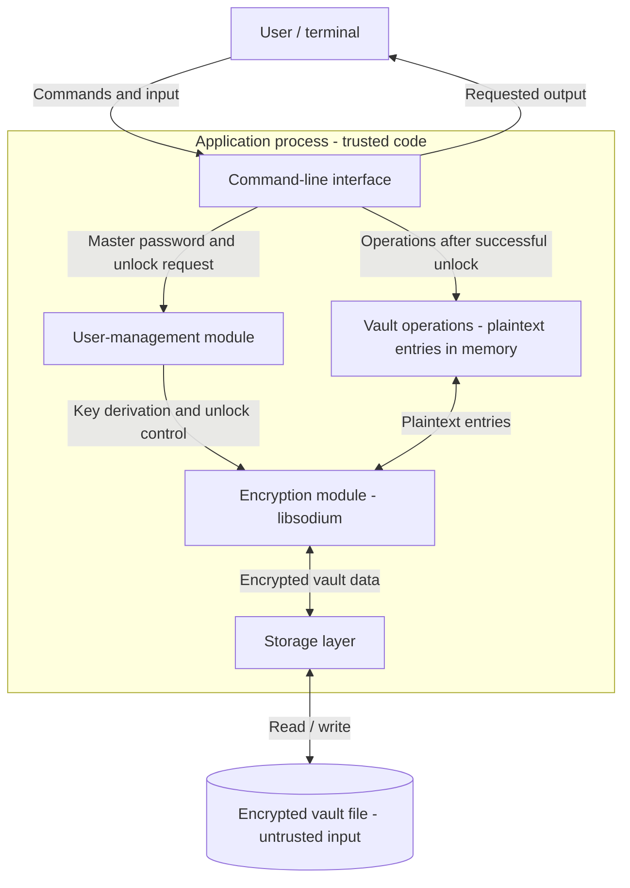

# Password Manager - Design Document

## 1. Overview

The application is a local command-line password manager written
in C++17. It uses libsodium to protect a vault containing service
names, usernames, and passwords.

## 2. Architecture

### Components

- **Command-line interface:** parses commands, reads user input,
  and displays results. Master-password input is hidden.
- **User-management module:** controls vault creation, unlocking,
  and locking. This version uses a master password per vault,
  without a separate account database.
- **Vault operations:** adds, lists, retrieves, updates, and deletes
  entries after the vault has been unlocked.
- **Encryption module:** derives a key from the master password,
  encrypts vault contents, and verifies integrity before releasing
  decrypted contents.
- **Storage layer:** reads and writes the encrypted vault file
  and handles file errors.

### Data flow

1. The user selects a command and a vault file.
2. The application requests the master password without terminal echo.
3. The encryption module derives a key using the password and the
   vault's stored key-derivation parameters.
4. The application verifies and decrypts the vault. If verification
   fails, it rejects the unlock request.
5. The requested operation is performed on entries in memory.
6. Changes are encrypted and written back to disk.
7. On locking or exit, sensitive buffers are explicitly cleared
   where possible and resources are released.

### Storage and trust boundaries

- The vault file stores encrypted entries and the public metadata
  needed for decryption. The exact format is defined separately.
- The application does not intentionally write the master password,
  encryption key, or decrypted entries to disk.
- Sensitive data exists in process memory while the vault is unlocked.
- Terminal input and vault-file contents cross into the application
  and must be validated.
- Displaying a password crosses the boundary from process memory
  to the terminal and requires an explicit retrieval command.
- The operating system and application executable are assumed trusted.
  Protection against a compromised operating system is out of scope.

## 3. Threat Model

### Assets and attacker capabilities

The assets are the master password, encryption key, stored
credentials, and the integrity and availability of the vault.

An attacker may obtain a copy of the vault, modify its contents,
provide malformed input, or observe terminal output.
The operating system and application executable are assumed trusted.

### Threats and planned mitigations

| Area | Threat | Planned mitigation |
| --- | --- | --- |
| Master password | An attacker guesses the password using a stolen vault file. | Derive the key using Argon2id with a random salt and deliberately expensive memory and CPU parameters. Encourage a long, unique master passphrase. |
| Master password | The password leaks through terminal echo, shell history, or logs. | Read it using a hidden interactive prompt. Never accept it as a command-line argument or include it in logs. |
| Vault at rest | A stolen vault exposes stored credentials. | Encrypt all entry fields using authenticated encryption. Never store the master password or encryption key in the vault. |
| Vault integrity | An attacker modifies the encrypted contents. | Verify the authentication tag before using decrypted data. Reject the vault if verification fails. |
| Vault in memory | Passwords or keys remain in memory after use or appear in memory dumps. | Minimise secret copies and their lifetime. Use explicit secure clearing for sensitive buffers, attempt memory locking, and disable core dumps where supported. Check failures and document platform limitations. |
| Interface | Passwords are exposed through routine output or terminal history. | Hide password input. List entries without passwords. Reveal a password only through an explicit retrieval command; warn that displayed output may remain in terminal scrollback. |
| File parsing | A malformed vault causes excessive allocation, crashes, or unsafe memory access. | Validate the format version, lengths, file size, and key-derivation parameters before expensive processing. Reject unsupported or out-of-range values. |
| File storage | Another local user reads or replaces the vault file. | Use owner-only permissions where supported, reject symbolic links, and create temporary files securely in the same protected directory. |
| Saving changes | A failed write damages the existing vault. | Write encrypted data to a temporary file, check write and flush errors, and atomically replace the original only after a successful write. |

### Residual risks and limitations

- A weak master password may still be guessed despite Argon2id.
- Encryption does not prevent deletion of the vault or replacement
  with an older valid copy.
- Forgotten master passwords cannot be recovered by the application.
- Memory clearing and locking cannot guarantee removal of every
  secret copy or prevent all operating-system disk writes.
- Malware running with sufficient privileges, keyloggers, and a
  compromised operating system are outside the protection scope.
