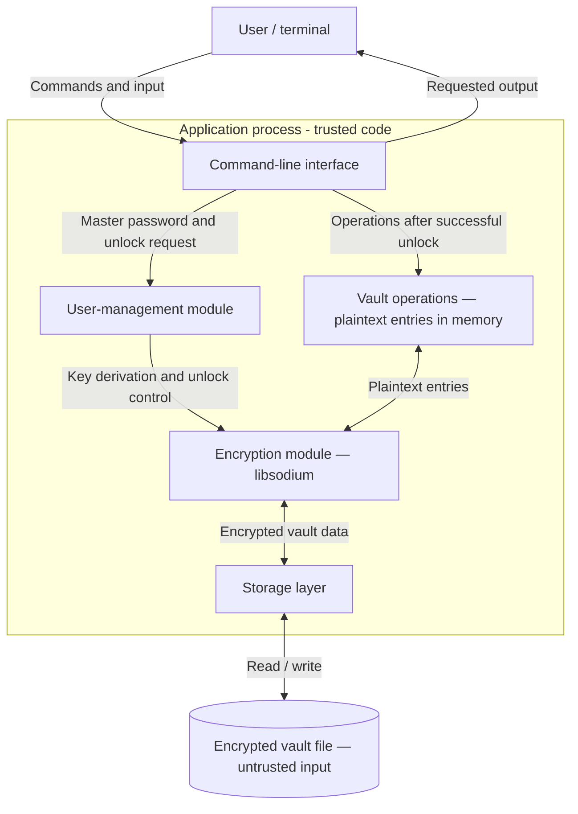

# Password Manager - Design Document

## 1. Overview

The application is a local command-line password manager written
in C++17. It uses libsodium to protect a vault containing service
names, usernames, and passwords.

## 2. Architecture

### Components

- **Command-line interface:** parses commands, reads user input,
  and displays results. Master-password input is hidden.
- **User-management module:** controls vault creation, unlocking,
  and locking. This version uses a master password per vault,
  without a separate account database.
- **Vault operations:** adds, lists, retrieves, updates, and deletes
  entries after the vault has been unlocked.
- **Encryption module:** derives a key from the master password,
  encrypts vault contents, and verifies integrity before releasing
  decrypted contents.
- **Storage layer:** reads and writes the encrypted vault file
  and handles file errors.

### Data flow

1. The user selects a command and a vault file.
2. The application requests the master password without terminal echo.
3. The encryption module derives a key using the password and the
   vault's stored key-derivation parameters.
4. The application verifies and decrypts the vault. If verification
   fails, it rejects the unlock request.
5. The requested operation is performed on entries in memory.
6. Changes are encrypted and written back to disk.
7. On locking or exit, sensitive buffers are explicitly cleared
   where possible and resources are released.

### Storage and trust boundaries

- The vault file stores encrypted entries and the public metadata
  needed for decryption. The exact format is defined separately.
- The application does not intentionally write the master password,
  encryption key, or decrypted entries to disk.
- Sensitive data exists in process memory while the vault is unlocked.
- Terminal input and vault-file contents cross into the application
  and must be validated.
- Displaying a password crosses the boundary from process memory
  to the terminal and requires an explicit retrieval command.
- The operating system and application executable are assumed trusted.
  Protection against a compromised operating system is out of scope.
